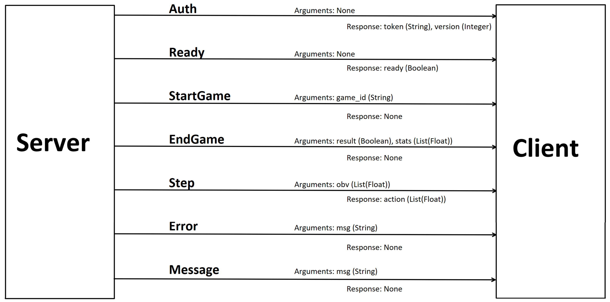
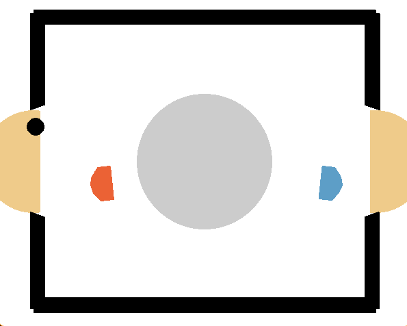
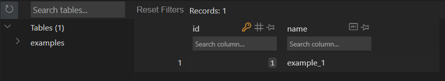

# <!--fit--> COMPRL 🎮

By: Svea Gänzle, Paul Masan, Paco Schatz, Carina Straub


---
## Table of content

* Structure
* Twisted: AMP
* User Stories
* Example Games
* Database
* Matchmaking
* Robust
* Web
* Problems/Concerns
---

## Structure
- Competition-Server
  - Client
  - Server
- (Web)

* Event-Loop based on Twisted
* Abstraction between networking and logic
* Using Interfaces to communicate between Twisted and logic.
`networking.launch_...(Interface)`
---

## Structure/Server
* ```comprl.server``` with `__main__.py` runs a server instance.
* Configuration via config-file or command line args
* Provided by us (`IServer` -> `Server`)
* Managers: `GameManager`, `PlayerManager`, `MatchmakingManager`
* Interfaces: `IGame`, `IPlayer`, `IServer`
* Networking module implements a `COMPPlayer`
* SQLite-Backend for storage

---
## Structure/Server
config.toml
```toml
[CompetitionServer]
    port = 65335
    timeout = 10
    log = "DEBUG"
    game_path = "examples\\simple\\game.py"
    game_class = "ExampleGame"
    game_db_path = "simple_games.db"
    game_db_name = "data"
    user_db_path = "simple_users.db"
    user_db_name = "data"
```
---

## Structure/Client
* ```comprl.client``` provides the package for users
* Handles only requests made by server only
* Implemented by User

---
## AMP Protocol 

* Asynchronous Messaging Protocol
* Developed by Twisted
* exchange asynchronous messages between client and server 
(structure of the messages, corresponding methods)
* uses Callbacks and Deferred

---

## AMP Protocol - `shared/commands` (1/2)

* defines commands for server client communication
* command: a class that inherits from `twisted.protocols.amp.Command`
* Each command contains arguments and a response definition
```python
class Step(Command):
  """Command for requesting the next step from the agent"""

  arguments = [(b"obv", ListOf(Float()))]
  response = [(b"action", ListOf(Float()))]
```

---

## AMP Protocol - `shared/commands` (2/2)

<style scoped>
p { text-align: center; }
</style>


---

## AMP Protocol - `ClientProtocol` (1/2)

* `client/networking` module: defines the protocol for client communication with the server
* `class ClientProtocol`: inherits from `twisted.protocols.amp.AMP`, implements methods for various events
* Each command has a responder that is called when the corresponding command is received. 
* These responders call the corresponding methods in the agent and process the responses.

---

## AMP Protocol - `ClientProtocol` (2/2)

```python
@Ready.responder
def ready(self):
  return {"ready": self.agent.is_ready()}

@StartGame.responder
def start_game(self, game_id: int):
  self.agent.on_start_game(game_id)
  return {}
```

---


## AMP Protocol - `COMPServerProtocol` (1/3)

* `server/networking` module: defines the protocol for server communication with the client
* `class  COMPServerProtocol`: 
inherits from `twisted.protocols.amp.AMP`, contains similar methods to the client protocol to manage the connection and communication


---


## AMP Protocol - `COMPServerProtocol` (2/3)

* `connection_made_callbacks`
* `connection_lost_callbacks`
* `connection_timeout_callbacks`
* `connection_error_callback`
---

## AMP Protocol - `COMPServerProtocol` (3/3)

```python
def is_ready(self, return_callback: Callable[[bool], None]) -> bool:
  return (
    self.callRemote(Ready)
    .addCallback(callback=lambda res: return_callback(res["ready"]))
    .addTimeout(ConfigProvider.get("timeout"), reactor, self.connectionTimeout)
    .addErrback(self.connection_error)
  )

def notify_start(self, game_id: GameID) -> None:
  return self.callRemote(StartGame, game_id=game_id.bytes)
```

---

## AMP Protocol - `COMPFactory` 

* `class COMPFactory`: inherits from `twisted.internet.protocol.ServerFactory`
* factory for creating COMP servers
* is responsible for starting, stopping the server and creating protocols for incoming connections
* creates instances of the server protocol for each incoming connection and configures the corresponding callbacks

---

## User Stories: IDs explained

#### User-ID (int)

* Primary Key for the User database
* is linked to the matchmaking parameters and elo

#### Player-ID (UUID)

* Is used to handel and identify clients internally
* Only used during runtime
* There can be different players with the same User-ID

---
## User Stories: IDs explained

#### Game-ID (UUID)

* Is used to identify the game during runtime
* Is used as a primary key in the game database
* files name of the game files with all actions 

---
## User Stories: Passwords/Tokens explained

#### Username and Password

* Used for login to the website
* can be freely chosen
* username is used for leaderboard

#### Token

* get from the website
* unique for every user (automatically generated)
* used for authentication when connecting an agent to the server

---

## User Stories: Client/Agent/Student

* Derive a new agent from the Interface `Agent()` 
* Either direct: `MyAgent(Agent): ...`
* Or with decorators:

```python
myAgent = Agent()

@myAgent.event
def get_step(obv: list[float]):
    ...
```

---

## User Stories: Client/Agent/Student

`get_step(obv: list[float]) -> list[float]`

* has to be implemented
* gets an observation as input
* returns the next action
* How to interpret the observation and the action has to be specified separately

---
## User Stories: Client/Agent/Student

`on_start_game(game_id: UUID)`

* is called, when the game starts
* Game-ID (UUID) can be stored to find games later

`on_end_game(result: bool, stats: list[float])`

* is called, when the game ends
* Result indicates, if the game was won
* Stats are all statistics that the player should receive (e.g. scores)

---

## User Stories: Client/Agent/Student
  
`is_ready() -> bool`

* Is called, to ask if the client is ready for an other game
* Can be used to disconnect smoothly (e.g. after 10 games)
* Retuns true by default

`on_error(msg)`, `on_message(msg)`, `on_disconnect()`

* Are used for communication from the server to the client
* Print a message by default

---
## User Stories: Server/Game/Lecture

* Derive a new game from the interface `IGame` 
* Game Class only implements game logic
* All the networking is handled (e.g. collecting actions, disconnected players)
* Writing the result into the database is handled
* Game can be easily modified to a game with more than two players (Matchmaking, Database update)

---
## User Stories: Server/Game/Lecture

`self.players: dict[PlayerID, Player]`
Dictionary with all players of the game

`self.scores: dict[PlayerID, float]`
Dictonary with all scores (defaults to all scores 0.0)

`update(actions: dict[PlayerID, list[float]]) -> bool`

* Updates the environment 
* Input: All the collected actions in a dictionary
* Returns `True` if the game should end `False` otherwise

---
## User Stories: Server/Game/Lecture

`_validate_action(action: list[float])`

* Returns `True` if the action is valid
* Disconnects the player if the action is invalid which ends the game

`_get_observation(id: PlayerID) -> list[float]`
* Returns the observation that should be sent to this player
* Observations can be sent to each player individually (e.g. for left and right players)

---
## User Stories: Server/Game/Lecture

`_player_won(id: PlayerID) -> bool`

* Returns `True` if the player has won, `False` otherwise
* Should return `False` for all players in case of a draw

`_player_stats(id: PlayerID) -> list[float]`

* Is called at the end of the game
* Can be used to communicate Statistics at the end of the game
* e.g. scores, disconnects, rounds, ...

---


## Games and game logic

We tried to make the game logic modular, so different games can be implemented.

We provide 3 examples:

* simple game (\examples\simple\game.py)
  * agents send integers, these are added up, when the sum reaches 10 the game ends
  * demonstrates basics of a game and easy for testing
* rock paper scissor (\examples\rockpaperscissors\server.py)
  * rounds of rock paper scissor until one player has 3 points

---

## Games and game logic - Hockey Game

We implemented your [Hockey Game](https://github.com/martius-lab/laser-hockey-env/).

* Each instance of `HockeyGame()` contains a Hockey gym-env
* There are several rounds played with the possibility to swap sides after each round
* Each step, actions are collected, stacked, the step is performed and both players receive the right observations for their side
* After the game actions, observations and score are stored

---

## Live Demo

<style scoped>
p { text-align: center; }
</style>

Tooooooor!!!!

---


## Database - SQLite3
* Simple, serverless database engine
* Low consumption of resources
* Portability
* Open source and license-free

---

## Database - SQLite3: Example (1/2)
```python
import sqlite3

connection = sqlite3.connect('example.db')
cursor = connection.cursor()
table = "examples"
cursor.execute(f"""CREATE TABLE IF NOT EXISTS {table}
              (id INTEGER PRIMARY KEY AUTOINCREMENT, name TEXT)""")
cursor.execute(f"INSERT INTO {table} (name) VALUES (?)", ("example_1",),)
connection.commit()
cursor.execute(f"SELECT * FROM {table}")
examples = cursor.fetchall()
connection.close()
```

---

## Database - SQLite3: Example (2/2)
<style scoped>
p { text-align: center; }
</style>


---
## Database - Interfaces (1/3)

`class GameEndState:`

* WIN = 0
* DRAW = 1
* DISCONNECTED = 2

---

## Database - Interfaces (2/3)
`class GameResult:`

```python
game_id: GameID,
user1_id: int,
user2_id: int,
score_user_1: float,
score_user_2: float,
start_time=None,
end_state: GameEndState = GameEndState.WIN,
is_user1_winner: bool = True,
is_user1_disconnected: bool = True,
```

---

## Database - Interfaces (3/3)

`class UserRole:`

* USER = "user"
* ADMIN = "admin"

---

## Database - UserData
<style scoped>table { font-size: 70%; }</style>
|user_id | username | password| role| token | mu | sigma |
|--- | --- | --- | --- | --- | --- | --- |
| int | str | str | str/UserRole, optional | str | float, optional | float, optional | 

* `add`
* `remove`
* `is_verified`
* `get_user_id`
* `get_matchmaking_parameters`
* `set_matchmaking_parameters`

---

## Database - GameData
<style scoped>table { font-size: 70%; }</style>
|game_id | user1 | user2 | score1 | score2 | start_time | end_state | winner | disconnected|
|--- | --- | --- | --- | ---- | --- | --- | --- | ---|
|GameID (UUID) | int | int | float | float | str, optional | GameEndState | int | int |

* `add` 
* `remove` 

---

## Database - Scripts (1/3)

`new_user.py`

* `insert_user` inserts a user with a random token and a given name, password and role.
* Define the name of the user in the terminal.
* Then set a password and a role for this user in the terminal.
* Add as many users as you want.
* Press ENTER instead of typing a name to end the script.
* config file, parsing is supported

---

## Database - Scripts (2/3)

`dummy_user.py`

* `insert_users` inserts user `test1`-`test4` with `password1`-`password4` and `token1`-`token4`
* config file, parsing is supported

---

## Database - Scripts (3/3)

`reset.py`
* `reset_games` deletes the game table.
* `reset_elo` resets the elo to `mu=25.000` and `sigma=8.333`.
* safety question to prevent accidental resets
* config file, parsing is supported

---

## Database - Web

* works with the same databases (so far only user database)
* same columns
* supports adding new user
* displays token

---

## Matchmaking - principle

* Each player get's a rating consisting (mainly) of:
  * a $\mu$ (`mu`) value: The average performance of the player
  * a $\sigma$ (`sigma`) value: The uncertainty of the skill
* ratings are used to predict outcomes of a game
* updated after a game

---

## Matchmaking - Openskill

Matchmaking based on [openskill](openskill.me):

* alternative to microsofts true skill
* open source
* easy to use like trueskill
* suitable for more variants of multiplayer games (not relevant)

We used the [Plackett-Luce Model](https://openskill.me/en/stable/api/openskill/models/weng_lin/plackett_luce/index.html#openskill.models.weng_lin.plackett_luce.PlackettLuce)

* standard model fo most types of games

---

## Matchmaking - Functionality

* Agents joining are put in the queue
* Fix percentage of online players are always waiting in queue
* Every few seconds matchmaking is updated and possible matches are formed
* match is suitable if:
 $\textit{probability of a draw} + \textit{time bonus} > \textit{threshold}$
* $\textit{time bonus} = \textit{combined waiting time in min}\cdot \textit{0.1}$
* after a match `mu` and `sigma` are updated based on score
  
---

## Matchmaking - Flaws

* Our thresholds, time bonus, ... are not at all tested and need to be tweaked
* TODO provide easy access to these parameters (i.e. config file)
* If not enough players (of your skill) are online, you don't play
* TODO: If not enough players are present, match with bots
* we currently take the first suitable match, not the best

---

## Robust - Disconnects

* The player gets removed from the connected and authenticated players
* Every game that the player is playing is ended
* The game is marked in the database as disconnected because of this player
* All the other players are put back in matchmaking

---

## Robust - Input Validation / Authentication
* Every player has a `disconnect(reason)` method
* The reason gets sent before the actual disconnect as an error
* After the player is connected, the server asks the client to authenticate
  If the token is not valid, the player gets disconnected
* Every Input gets validated
  If an action is not valid, the player gets disconnected

---

## Web

* Based on React using Remix and Material UI
* Users can register by a provided Master-Key.
* Authentication is implemented by using the Remix-Auth package.
* Multi-Page-Dashboard
* Responsive Design

---

## Problems/Concerns

* Wasted time on trying to combine Twisted with asyncio
* Circular imports 👿
* Project-Layout
* Twisted runs one one thread natively
* SQLite